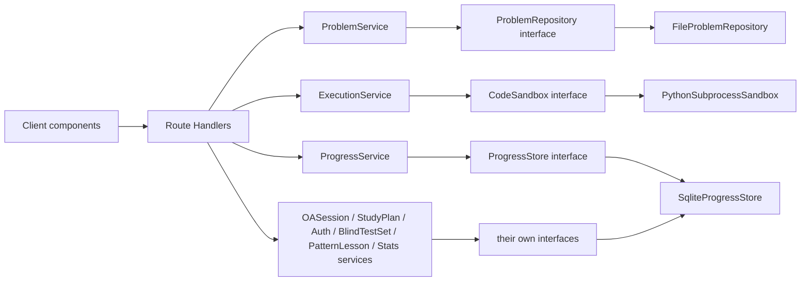

# Architecture — DSA Practice App

Living doc, source of truth for **project-specific** decisions (see [`projectGuidelines.md`](projectGuidelines.md) for the generic pattern guide, which takes precedence on any conflict). Sections below describe what's actually built; deviations from the original proposal are called out inline rather than silently edited over.

## Stack

Next.js (App Router), TypeScript strict, full-stack in one app — no separate backend process. API routes replace FastAPI; a local file/SQLite-backed store replaces the DAO layer's SQLite impl. Same interface-first shape as the SAR project, fewer moving parts to boot.

Submissions are authored and executed as **Python**, not JS/TS — the `CodeSandbox` implementation is `PythonSubprocessSandbox` (see below), a deviation from this doc's original proposal.

## Runtime shape

```text
Browser (Next.js client components)
        |
        | typed fetch (src/lib/api-client.ts)
        v
Next.js Route Handlers (src/app/api/**)
  thin — parse, call a service, return a schema
        |
        v
Services (src/server/services/*)
  ProblemService       --> ProblemRepository   --> problem JSON files on disk
  ExecutionService      --> CodeSandbox         --> Python subprocess today, swappable later
  ProgressService       --> ProgressStore       --> SQLite (better-sqlite3) today
  OASessionService       --> OAProblemSelector, ProgressStore, ExecutionService
  StudyPlanService       --> StudyPlanStore, FileStudyCurriculumRepository, ExecutionService, GeminiClient
  AuthService            --> AuthStore (SqliteProgressStore also implements this)
  BlindTestSetService    --> BlindTestSetStore, ProblemRepository
  PatternLessonService  --> PatternLessonRepository
  StatsService           --> StatsStore
```

Shipped beyond the original four-service proposal: **auth** (session-based login, gates all routes), **study plan** (a large per-user curriculum/roadmap/spaced-repetition system, its own section below), **blind test sets** (user-curated problem sets for Blind Test Mode, beyond single-problem blind attempts), **stats** (append-only cross-app activity events for the profile/dashboard views), and **pattern lessons** (structured per-pattern learning content, `/patterns`, which this doc's original "reserved nav slot only" note said was deferred — it's now built). `SqliteProgressStore` implements `ProgressStore`, `OASessionStore`, `BlindTestSetStore`, `StudyPlanStore`, `AuthStore`, and `StatsStore` — all six store interfaces — against the same `data/progress.db` connection, following the same "one store, one file, multiple interfaces" convention documented in the Mock OA implementation notes below. `container.ts` still constructs it exactly once and passes it wherever any of the six interfaces is needed.



The full per-service breakdown (nine services, not three) is in the Runtime shape text block above and the sections below — this diagram stays intentionally coarse so it doesn't need editing on every new feature.

## Why interfaces per seam, not one blob

Per the original brief: problem data, execution, and progress had to be swappable independently (e.g. add NeetCode 150 as a second problem source, or swap the sandbox for a real container later) without touching UI. That held as the app grew — every feature added since (auth, study plan, blind test sets, stats, pattern lessons) got its own interface and its own directory rather than being folded into an existing one, so the seam count is now nine, not three, but the rule that motivated it is unchanged.

## Layers

| Layer | Path | Allowed to know |
| --- | --- | --- |
| UI (client) | `src/app/**/*.tsx`, `src/components/` | Presenters, `ApiClient`, view types |
| Presenters | `src/presenter/` | Domain/view types only — **no React imports** |
| Route Handlers | `src/app/api/**/route.ts` | Zod schemas, services, `auth-context.ts` — no direct repo/store access |
| Services | `src/server/services/` | Interfaces (one per seam — see `src/server/interfaces/`) |
| Repository/store interfaces | `src/server/interfaces/` | Domain types only |
| Implementations | `src/server/repositories/`, `src/server/sandbox/`, `src/server/store/` | Domain types + their own storage detail (fs, subprocess, sqlite) |
| Composition | `src/server/container.ts` | Concrete types — the only file allowed to `new` an implementation |

Route Handlers must not contain business logic — same rule as the SAR routes layer.

## Composition root

`src/server/container.ts`, a singleton built once per server process (memoized on `globalThis.__dsaContainer` outside production, so Next.js dev-mode hot reload doesn't rebuild it on every request):

1. `FileProblemRepository(problemsDir)`, `FilePatternLessonRepository(lessonsDir)`, `FileStudyCurriculumRepository(studyCurriculumPath)` — reads `src/data/problems/**`, `src/data/lessons/**`, `src/data/study-plan/curriculum.json`
2. `PythonSubprocessSandbox()` — today's `CodeSandbox`; swappable for a container-based sandbox later
3. `SqliteProgressStore(dbPath)` — `data/progress.db`, created on first run; implements all six store interfaces
4. `GeminiClient` — constructed only when `DSA_GEMINI_API_KEY` is set, else `null`
5. Nine services built from the above: `ProblemService`, `ExecutionService`, `OASessionService`, `StudyPlanService`, `ProgressService` (takes `StudyPlanService` too, for the cross-app completion hook), `BlindTestSetService`, `PatternLessonService`, `AuthService`, `StatsService`

Route Handlers import the container, never a concrete class. Tests construct their own container with an in-memory `ProgressStore` and a temp problems dir, so they never touch `data/`.

```text
# allowed
class SqliteProgressStore implements ProgressStore { constructor(dbPath: string) {} }

# in container.ts only
const progressStore = new SqliteProgressStore(config.dbPath)

# forbidden in route handlers / services / presenters
import { SqliteProgressStore } from "@/server/store/sqlite-progress-store"
new SqliteProgressStore(...)
```

## Domain types vs wire types

Same split as SAR's D6/D7: internal domain types live in `src/server/models/domain.ts`; anything crossing the HTTP boundary is validated with a Zod schema in `src/server/models/schemas.ts`, and the client-side mirror lives in `src/types/*.ts`. Since this is TypeScript end to end, domain and wire types can share a base shape — but request/response shapes are still their own Zod-validated types, not the same object the sandbox or repository pass around internally. Convert at the route handler boundary.

JSON on the wire is camelCase. Internal domain types are also camelCase (no snake_case bridge needed in a TS-only stack) — this is a deliberate deviation from the SAR project's Python/TS casing bridge, noted here so it doesn't look like an oversight.

## Interface contracts

### ProblemRepository

```ts
interface ProblemRepository {
  getById(id: string): Promise<Problem | null>
  list(filter?: { pattern?: DsaPattern; difficulty?: Difficulty; query?: string }): Promise<ProblemSummary[]>
  listPatterns(): Promise<DsaPattern[]>
}
```

- `FileProblemRepository` today, reading structured JSON from `src/data/problems/` (no MDX — plain JSON only).
- A second source (NeetCode 150) is a second directory + a merge at this interface — no schema change, per your requirement that NeetCode 150 slot in later without a rework.

### CodeSandbox

```ts
interface CodeSandbox {
  run(submission: CodeSubmission, testCases: TestCase[]): Promise<ExecutionResult>
}
```

**Implemented as `PythonSubprocessSandbox`** (`src/server/sandbox/python-subprocess-sandbox.ts`), not the `NodeVmSandbox` originally proposed above — submissions and problem content are Python, so execution needed a real Python interpreter, not a JS VM. The interface didn't change; only the bound implementation did, which is exactly the seam this doc's "swapping infrastructure later" section exists for.

- The submission + test cases are sent as JSON over stdin to `src/server/sandbox/python_worker.py`, spawned per call via `child_process.spawn`. The worker runs everything and writes a single JSON `ExecutionResult` to stdout.
- **Process-group kill, not `child.kill()`.** The worker is spawned with `detached: true` so it owns its own OS process group. A submission that spawns its own thread or subprocess would otherwise survive a plain `child.kill()` as an orphan; killing with `process.kill(-pid, "SIGKILL")` (negative pid = "whole group") takes the worker and anything it spawned down together.
- **Deadline enforced by the parent, not the worker.** The parent sets a `setTimeout` (`timeoutMs * (testCases.length + 1) + 1000`) on its own event loop and kills the process group on expiry — the same "an OS-level operation the hung child can't block" principle the original `worker_threads`/`vm` design called for, just applied to a subprocess instead of a Worker.
- **Known limitation, not a bug:** same as the original design intent — this bounds wall-clock time for a single local user's own code; it is not a security boundary for untrusted or concurrent multi-tenant use (no seccomp/container isolation, just OS process + timeout).
- Swap target later: a real isolate (container or hosted execution service) still implementing the same `CodeSandbox` interface. Nothing above the interface changes.
- `ExecutionResult` reports per-test pass/fail, actual vs expected output, stdout, runtime, and a distinguished `timeout | runtime_error | wrong_answer | passed` status — never a bare boolean, so the UI can render *why* a case failed. Hidden test cases have `input`/`expected`/`actual` stripped before reaching the client (`toClientExecutionResult`, see Mock OA implementation notes below) — this applies to every consumer of `ExecutionResult`, not just OA.

### ProgressStore

```ts
interface ProgressStore {
  recordAttempt(attempt: AttemptRecord): Promise<void>
  getProgress(problemId: string): Promise<ProblemProgress | null>
  listProgress(): Promise<ProblemProgress[]>
}
```

- `SqliteProgressStore` today (`better-sqlite3`, single file, no server process — matches your Docker-free, low-overhead priority).
- Schema documented in full in `CONTRACTS.md` (to be written alongside scaffolding, mirroring `04-contracts.md`'s table format) — but the key design point now: `AttemptRecord` stores one row per attempt (not an overwritten "latest state"), so mastery/spaced-repetition scheduling can later be derived from attempt history without a schema change. `ProblemProgress` is a computed view over attempts (status: `not_started | attempted | solved | mastered`, hints used, last-reviewed date), not a separately-maintained mutable row — avoids the two-writes-can-disagree bug class.

## Practice Mode vs Blind Test Mode

Both modes share `ExecutionService` and the editor/test-runner UI. They differ only in what the **presenter** is allowed to read from `Problem`:

```text
PracticePresenter   — full Problem (prompt, examples, constraints, hints[], solution, pattern, difficulty)
BlindTestPresenter   — StrippedProblem (title, prompt, examples, constraints only — no pattern, no difficulty, no hints, no solution)
```

`StrippedProblem` is a real type derived from `Problem` at the service boundary (`ProblemService.getForBlindTest(id)`), not a UI-side filter — so a bug can't leak the pattern tag into Blind Test by rendering the wrong field. This mirrors the SAR project's habit of encoding a hard rule as a type rather than a comment ("do not render X here").

## Mock OA Mode (built)

Simulates a timed Google-style online assessment: a fixed-length, difficulty-driven session across multiple problems, distinct from untimed single-problem Practice/Blind Test attempts. Was deferred until Practice Mode and Blind Test Mode worked end-to-end, since it reuses their editor/test-runner UI rather than building its own — that dependency was satisfied and Mock OA shipped (see Implementation notes below and Nav item "Mock Interviews" / `/oa`).

**Reuses, unchanged:** `ProblemRepository`, `CodeSandbox`/`ExecutionService`, `ProgressStore`, the editor + test-runner component. Mock OA does not get its own problem data model — it is another consumer of the same core seams, alongside Practice and Blind Test.

**Net-new:** a session/timer state model and a difficulty-driven problem selector, behind a new `OASessionManager` service — kept separate from `ProblemService`/`ExecutionService`/`ProgressService` rather than folded into them, so the three existing modes stay simple consumers of the same underlying layers.

### OASessionManager

```ts
interface OASessionManager {
  startSession(config: OASessionConfig): Promise<OASession>
  getSession(sessionId: string): Promise<OASession | null>
  saveProgress(sessionId: string, problemId: string, code: string): Promise<OASession>
  submitProblem(sessionId: string, problemId: string, submission: CodeSubmission): Promise<OASession>
  endSession(sessionId: string): Promise<OASessionSummary>
}
```

- `startSession` selects `config.problemCount` problems matching `config.difficulty` (a single `Difficulty` or a mix, e.g. `{ medium: 2, hard: 1 }`) via the selector below, and returns an `OASession` with `status: "in_progress"`, `startedAt` stamped server-side, and a `deadline` computed from `config.timeBudgetMs`.
- `saveProgress` persists in-editor code for a problem without submitting it — supports moving between problems and coming back later in the session, per the requirement that users can revisit earlier problems before time runs out.
- `submitProblem` runs the submission through the existing `CodeSandbox` (same as Practice/Blind Test) and updates that problem's status within the session; it does not end the session.
- A session auto-submits when `deadline` passes — enforced client-side by the persistent countdown timer calling `endSession`, and re-checked server-side on any call against an expired session (a late `submitProblem` against an expired session is rejected, same trust boundary as any other server-authoritative deadline).
- `endSession` finalizes the session (`status: "completed"` or `"expired"`), writes one `AttemptRecord` per attempted problem tagged `mode: "oa"` (see below) plus the session's own row in `oa_sessions` (see Persistence), and returns the post-session summary.

### Session/timer state model

```ts
export type OASessionStatus = "in_progress" | "completed" | "expired"
export type OAProblemStatus = "unanswered" | "in_progress" | "passed" | "failed"

export interface OASessionConfig {
  difficulty: Difficulty | Partial<Record<Difficulty, number>>
  problemCount: number
  timeBudgetMs: number
}

export interface OASessionProblemState {
  problemId: string
  status: OAProblemStatus
  code: string | null
  lastSubmissionResult: ExecutionResult | null
  timeSpentMs: number
}

export interface OASession {
  id: string
  status: OASessionStatus
  startedAt: string
  deadline: string
  problems: OASessionProblemState[]
  activeProblemId: string | null
}

export interface OASessionSummary {
  sessionId: string
  status: OASessionStatus
  problemsPassed: number
  problemsTotal: number
  perProblem: { problemId: string; status: OAProblemStatus; timeSpentMs: number }[]
}
```

`OASession` is the live, in-progress state a client polls/holds during the session (extends `PracticeMode` with an `"oa"` case in `AttemptRecord.mode`, rather than a parallel mode enum). `OASessionSummary` is the terminal, post-session view — a computed projection, same "don't store a redundant mutable view" rule `ProblemProgress` already follows.

### Problem selection

```ts
interface OAProblemSelector {
  selectForSession(config: OASessionConfig, recentSessionIds: string[]): Promise<ProblemSummary[]>
}
```

- Pulls candidates from the existing `ProblemRepository.list({ difficulty })` per difficulty bucket in `config.difficulty` — pattern is never part of the selection filter, so pattern tags stay hidden from the user exactly as in Blind Test Mode (`ProblemService.getForBlindTest`-style stripping applies to session problems too — the session never exposes `pattern` to the client).
- "Avoid repeating problems from recent OA sessions" is a soft preference, not a hard guarantee: filter candidates against problems used in `recentSessionIds` first, and only fall back to allowing repeats if too few unused problems exist at that difficulty (a thin library, like this one's, may not have enough per-difficulty inventory to guarantee no repeats — silently falling back beats failing to start a session).

### Persistence

One new table, following the `attempts` / `preferences` pattern already in place:

| Table | Purpose |
| --- | --- |
| `oa_sessions` | One row per session: `id`, `status`, `startedAt`, `deadline`, `config` (JSON), `problemIds` (JSON, ordered) |

Per-problem attempts within a session still write to `attempts` with `mode: "oa"` — `AttemptRecord.mode` (`src/server/models/domain.ts`) gains an `"oa"` variant alongside `"practice" | "blind"`, so OA attempts are queryable through the same table and distinguishable in history, per the requirement that OA sessions are tagged rather than indistinguishable from single-problem attempts. `OASessionSummary` is computed by joining `oa_sessions` with the matching `attempts` rows — not a separately-maintained mutable rollup, same reasoning as `ProblemProgress`.

### Out of scope for the first Mock OA pass

- Editing session config mid-session (difficulty/time budget are fixed at `startSession`)
- Cross-device session resume — a session lives for one browser session, matching the single-local-user scope already declared above
- Anti-repeat guarantee stronger than best-effort (see selector note above) — would require a much larger problem library than exists today

### Implementation notes (deviations from the draft above)

The contract above was implemented as drafted; the following are the concrete choices made where the draft deliberately left room for judgment:

- **`OASessionStore` interface** (`src/server/interfaces/oa-session-store.ts`, net-new, not in the original draft): a small persistence-facing interface — `createSession`, `getSession`, `updateStatus`, `listRecentSessionIds` — over the durable `oa_sessions` row shape (`id`, `status`, `startedAt`, `deadline`, `config`, `problemIds`). `SqliteProgressStore` implements both `ProgressStore` and `OASessionStore` against the same `data/progress.db` connection (one new `CREATE TABLE IF NOT EXISTS oa_sessions` in its existing `migrate()`), rather than a separate store class — it already owns the one DB file, and `oa_sessions` follows the same `attempts`/`preferences` migration convention in place. `container.ts` still only constructs one `SqliteProgressStore` and passes it wherever either interface is needed.
- **Live session state is in-memory, not fully persisted.** `OASessionService` (`src/server/services/oa-session-service.ts`) holds the live `OASession` (per-problem `code`, `lastSubmissionResult`, `timeSpentMs`, `activeProblemId`) in a `Map` for the process lifetime; only the durable summary shape (id/status/startedAt/deadline/config/problemIds) is written to `oa_sessions`. This satisfies the documented "one browser session, no cross-device resume" scope, but also means a dev-server restart mid-session loses in-progress code/results for that session (the row in `oa_sessions` still exists and is queryable, so it still feeds the selector's repeat-avoidance and history — just not live resume). If this needs to survive a restart later, `OASessionProblemState` would need its own persisted rows; not built now since it's explicitly out of scope.
- **`timeSpentMs` is accrued server-side**, not self-reported by the client: `OASessionService` tracks a last-touched timestamp per `(sessionId, problemId)` and adds the wall-clock delta (capped at 10 minutes per touch, to avoid inflating the figure if a tab sits idle) on every `saveProgress`/`submitProblem` call. This keeps the number out of the client's hands without adding a new endpoint.
- **Hidden test case stripping is shared, not duplicated.** The `/api/execute` route already stripped `input`/`expected`/`actual` off hidden `TestCaseResult`s before responding; that logic was extracted into `toClientExecutionResult` (`src/server/services/execution-result-view.ts`) so `OASessionService.submitProblem` applies the identical stripping before storing `lastSubmissionResult` on the session — otherwise a session fetch after submission would have leaked hidden-case answers that Practice/Blind Test already hide.
- **Problem content delivered to the OA client reuses the Blind Test route**, not a new "OA problem" endpoint: `OASession`/`OASessionProblemState` only ever carry `problemId` + session-local state (never `pattern`, `difficulty`, `title`, `prompt`, etc. — enforced by `oaSessionSchema`'s `.strict()`), and the in-session page fetches display content via the existing `GET /api/blind/[id]` (`StrippedProblem` — no pattern/difficulty/hints/solution). This is exactly the reuse the draft called for ("`ProblemService.getForBlindTest`-style stripping applies to session problems too") without adding a fourth problem-shaping path.

## Progress surfaced in the library view

`ProblemSummary` (list view) includes `progressStatus` computed by `ProgressService`, joined in the route handler — the library route handler calls both `ProblemService.list()` and `ProgressService.listProgress()` and merges by id. This keeps `ProblemRepository` ignorant of progress entirely (per the "allowed to know" table), so swapping either seam independently stays possible.

## Frontend MVP (same as SAR D9)

```text
page.tsx (View implementation, holds React state)
    --> one Presenter per feature, e.g. LibraryPresenter / PracticePresenter / BlindTestSetPresenter /
        OASessionPresenter / StudyPlanPresenter / DashboardPresenter / ProfilePresenter (no React)
          --> ApiClient
                --> GET /api/problems, GET /api/problems/:id, POST /api/execute, POST /api/progress, ...
```

Presenters are unit-testable without mounting a component — one per feature under `src/presenter/`, not just the original three. The editor is CodeMirror (`@uiw/react-codemirror` + `@codemirror/lang-python`, see Decisions confirmed below) as a client component.

### Shared layout / sidebar nav

`src/app/layout.tsx` renders a persistent left sidebar (`src/components/sidebar-nav.tsx`, a client component using `usePathname()` to highlight the active section) alongside `{children}`, rather than each route owning its own top-level chrome. The existing `ThemeToggle` now lives in the sidebar; individual pages that previously rendered their own toggle inline still do (harmless duplication, not removed, to avoid touching Practice/Blind Test page internals beyond the layout wrap).

Nav items (`src/components/sidebar-nav.tsx`), grown beyond the original three: **Dashboard** (`/dashboard`), **Library** (`/`, Practice + Blind Test entry), **Learn** (`/patterns` — this doc originally scoped this as a reserved nav slot with no content; pattern lessons are now fully built, see Pattern Lessons below), **Structures** (`/structures`), **Study Plan** (`/study-plan/**`, see Study Plan below), **Workbook** (`/blind`, `/blind/sets/**` — Blind Test Sets), **Mock Interviews** (`/oa`), and **Progress** (`/profile/stats`).

## Persistence

SQLite (`data/progress.db`) via `better-sqlite3`, one file, all app data except problem/lesson content — problems and pattern lessons are static seed files, not database rows, since they're authored content, not user data. This deliberately does not use SAR's "metadata in DB / binaries on disk" split, because there are no binaries here; noting the deviation rather than cargo-culting the pattern.

`SqliteProgressStore` owns all migrations in one `migrate()` (`src/server/store/sqlite-progress-store.ts`), gated by a `schema_meta` version row rather than a migration-file-per-change tool — appropriate for a single-file local DB with one writer process. Core tables, grouped by the store interface that owns them:

| Interface | Tables | Purpose |
| --- | --- | --- |
| `ProgressStore` | `attempts`, `preferences` | One row per run: `problemId`, `timestamp`, `passed`, `hintsUsed`, `durationMs`, `mode` (`practice` \| `blind` \| `oa`). `preferences`: single-row `theme`. |
| `OASessionStore` | `oa_sessions` | One row per Mock OA session — see Mock OA Persistence above. |
| `BlindTestSetStore` | `blind_test_sets`, `blind_test_set_problems` | User-curated problem sets for Workbook/Blind Test Mode. |
| `AuthStore` | `users`, `sessions` | Session-based auth — see Auth below. |
| `StudyPlanStore` | `study_tracks`, `study_patterns`, `study_problems`, `study_plans`, `study_problem_extensions`, `study_pattern_extensions`, `study_pattern_resources`, `skills`, `user_study_pattern_state`, `user_study_problem_state`, `study_plan_settings`, `study_sessions`, `mock_interview_results`, `study_problem_sessions`, `user_skill_state`, `readiness_checklist_state` | Per-user curriculum/roadmap system — see Study Plan below. Largest table group; full shapes live in the interface (`src/server/interfaces/study-plan-store.ts`) and `migrate()`, not duplicated here. |
| `StatsStore` | `user_stat_events` | Append-only cross-app activity log — see Stats below. |
| (meta) | `favorites`, `schema_meta` | `favorites`: starred problems. `schema_meta`: migration version tracking. |

`ProblemProgress` (status, last-reviewed, hints-used-ever) is computed from `attempts` on read — never stored directly — so spaced-repetition scheduling is an additional computed view later, not a migration. `study_problem_sessions` and `user_stat_events` follow the same append-only, never-updated convention as `attempts`.

## Auth

Session-based, single-process, local-first — not OAuth/third-party. `AuthService` (`src/server/services/auth-service.ts`) hashes+salts passwords and issues an opaque session id stored in `sessions`, checked via `src/server/auth-context.ts` on every route that needs a `userId` (most of the app now — Study Plan, favorites, and stats are all user-scoped). `AuthGate` (`src/components/auth-gate.tsx`) is the client-side redirect-to-login wrapper. This is a real deviation from the original "single local user, no login" out-of-scope line below — auth was added once multiple concurrent users (and per-user Study Plans) became a real requirement; the out-of-scope line is left below for history rather than silently deleted, per this doc's own "decisions carry their own reasoning" convention.

## Study Plan

The largest feature not in the original proposal. A per-user, per-plan curriculum: tracks → patterns → problems, with spaced-repetition-style pattern review (SM-2-lite, `recordPatternReview`), personalized priority overrides (set by an AI builder — see below), a roadmap view, mock-interview result logging, a readiness checklist, and cross-linked "skills." `StudyPlanService` (`src/server/services/study-plan-service.ts`) is the facade; `StudyPlanStore` (implemented by `SqliteProgressStore`) is the persistence interface; seed curriculum content is static JSON (`src/data/study-plan/curriculum.json`) read via `FileStudyCurriculumRepository`, following the same "seed data is files, per-user state is SQLite" split as problems/`ProblemProgress`.

**Cross-app completion hook:** solving a main-library `Problem` anywhere (Practice, Blind Test, or Mock OA) that's linked to a `StudyProblem` (`study_problem_extensions.linkedProblemId`) marks that `StudyProblem` complete too, across every plan that references it (`listStudyProblemsByLinkedProblemId`). `ProgressService` is constructed with `StudyPlanService` specifically to reuse this hook rather than duplicating completion logic against the raw store (see `container.ts`).

**AI plan builder:** `POST /api/study-plan/ai-builder` uses `GeminiClient` (`src/server/services/gemini-client.ts`) — not Claude — to turn company/role/background context into `personalizedPriorityRank`/`personalizedLikelihoodWeight` overrides on existing curriculum patterns. It does not generate new problems or curriculum content; it only reweights the existing seed. `geminiClient` is `null` when `DSA_GEMINI_API_KEY` is unset, and the route surfaces a clear "not configured" error rather than the app failing to boot (see `container.ts` comment).

## Pattern Lessons

`/patterns` (`PatternLessonService` → `PatternLessonRepository` → `FilePatternLessonRepository` reading `src/data/lessons/*.json`) — structured per-DSA-pattern learning content (two pointers, sliding window, DP, graphs, etc.), each with an interactive visualizer component under `src/components/lessons/*-demo.tsx` and `src/components/pattern-lab/`. This is a fourth seam alongside `ProblemRepository`/`CodeSandbox`/`ProgressStore`, following the same file-backed-repository-behind-an-interface shape. It supersedes this doc's original "`/patterns` — reserved nav slot + coming-soon page only" scoping.

## Blind Test Sets

`BlindTestSetService` (`src/server/services/blind-test-set-service.ts`) lets a user curate named sets of problems (beyond ad-hoc single-problem Blind Test attempts) via `/blind/sets/**`, backed by `BlindTestSetStore`. Distinct from Mock OA: sets are untimed, user-authored, and reusable; OA sessions are timed, system-selected, and single-use.

## Stats

`StatsService` → `StatsStore` (`user_stat_events`, append-only) records cross-app activity events (problem attempts, pattern reviews, session completions) keyed by `userId`, read by the dashboard and `/profile/stats` to compute streaks/activity views without each feature re-deriving activity from its own tables.

## Config

| Env | Default | Meaning |
| --- | --- | --- |
| `DSA_DB_PATH` | `data/progress.db` | SQLite file |
| `DSA_PROBLEMS_DIR` | `src/data/problems` | Problem source root |
| `DSA_LESSONS_DIR` | `src/data/lessons` | Pattern lesson source root |
| `DSA_STUDY_CURRICULUM_PATH` | `src/data/study-plan/curriculum.json` | Study Plan seed curriculum |
| `DSA_SANDBOX_TIMEOUT_MS` | `5000` | Per-test-case execution timeout |
| `DSA_PYTHON_BIN` | `python3` | Python interpreter used by `PythonSubprocessSandbox` |
| `DSA_GEMINI_API_KEY` | unset | Enables the AI Study Plan builder; feature returns a "not configured" error when absent |

## What's out of scope for the first pass

Following the SAR project's `06-out-of-scope.md` convention — stated so it reads as a decision, not a gap. Two lines below are now historical rather than current (see the notes attached to each) — left in place per this doc's own convention that decisions carry their reasoning even after superseded, rather than silently deleted:

- Spaced-repetition scheduling itself — **superseded:** SM-2-lite pattern review shipped as part of Study Plan (`recordPatternReview`).
- Multi-user auth/accounts, single local user, no login — **superseded:** session-based `AuthService`/`AuthStore` shipped once per-user Study Plans made multi-user a real requirement (see Auth above).
- A real sandboxed container/VM for code execution — still true. The sandbox implementation changed (Python subprocess, not Node `vm`) but the boundary claim is unchanged: OS process + timeout only, not a security boundary for untrusted multi-tenant use.
- NeetCode 150 seed data — still out of scope; schema supports it, data hasn't been added.
- OpenAPI/codegen between server and client — still out of scope; hand-mirrored types, same call as SAR's D6, revisit only if drift becomes painful.

## Swapping infrastructure later

| Interface | Today | Later |
| --- | --- | --- |
| `ProblemRepository` | `FileProblemRepository` | `HttpProblemRepository` (hosted problem source), multi-source merge |
| `CodeSandbox` | `PythonSubprocessSandbox` | Real isolate / hosted execution service |
| `ProgressStore` / `OASessionStore` / `BlindTestSetStore` / `StudyPlanStore` / `AuthStore` / `StatsStore` | `SqliteProgressStore` (implements all six) | Swap file for a hosted DB if this ever becomes multi-device |
| `PatternLessonRepository` | `FilePatternLessonRepository` | Second lesson source, same merge pattern as `ProblemRepository` |

Add one implementation + one line in `container.ts`. No service or route handler changes.

## Actual folder structure

Grown considerably past the original proposal below (auth, study-plan, blind-test-sets, stats, pattern-lessons all added their own repositories/services/interfaces following the same shape) — see `src/` directly for the current, authoritative listing rather than a hand-maintained tree here, which would drift again. The seam boundaries below still hold:

```text
src/
  app/                             # routes + api/** route handlers (thin, per-feature)
  components/                      # dumb UI, editor wrapper, lesson demos, pattern-lab, structure-lab
  presenter/                       # React-free view logic, one per feature
  server/
    container.ts                   # composition root — the only place that `new`s an implementation
    auth-context.ts                # session -> userId resolution for route handlers
    interfaces/                    # one interface per seam (repository/store/sandbox/selector)
    services/                      # one service per seam, facades over the interfaces
    repositories/                  # file-backed repository implementations
    sandbox/                       # python-subprocess-sandbox.ts + python_worker.py
    store/                         # sqlite-progress-store.ts (implements 6 store interfaces)
    models/                        # domain.ts, schemas.ts (+ ai-study-plan-schema.ts)
  types/                           # client-side mirrors
  lib/                             # api-client.ts + shared client utils
  data/
    problems/                      # seed content, one JSON file per problem
    lessons/                       # seed content, one JSON file per pattern lesson
    study-plan/curriculum.json     # seed curriculum for Study Plan
data/
  progress.db                      # gitignored — the one SQLite file for all app data
```

## Decisions confirmed

1. **Editor:** CodeMirror. Lighter bundle, faster to stand up than Monaco — fits the limited-time constraint. Loaded as a client component; no SSR concerns since it's a leaf UI component, not a map-style library needing `next/dynamic`.
2. **Seed data:** Claude authors original prompt/example/constraint/hint/solution text per Blind 75 problem — not copied verbatim from LeetCode or any single source. Content is generated to be reviewed and edited by you, same as any other scaffolded file.
3. **Hint tracking:** locked in. Revealing any hint during an attempt permanently sets `hintsUsed > 0` (and records how many) for that `AttemptRecord`, regardless of whether the user later solves it without referring back. Matches real interview honesty — once you've seen a hint, the attempt isn't "cold" anymore. This requires no schema change from what's above: `attempts.hintsUsed` is written once per attempt at submission time, sourced from a running counter the presenter increments on each reveal and never decrements.
