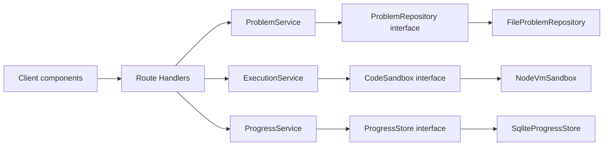

# Architecture — DSA Practice App

Proposed. Do not scaffold from this until you approve it (per `00-agent-onboarding.md`'s deliverable order). Conventions follow `STYLE_GUIDE.md`, adapted from the SAR project docs.

## Stack

Next.js (App Router), TypeScript strict, full-stack in one app — no separate backend process. API routes replace FastAPI; a local file/SQLite-backed store replaces the DAO layer's SQLite impl. Same interface-first shape as the SAR project, fewer moving parts to boot.

## Runtime shape

```text
Browser (Next.js client components)
        |
        | typed fetch (src/lib/api-client.ts)
        v
Next.js Route Handlers (src/app/api/**)
  thin — parse, call a service, return a schema
        |
        v
Services (src/server/services/*)
  ProblemService    --> ProblemRepository   --> problem JSON/MDX files on disk
  ExecutionService  --> CodeSandbox         --> in-process VM today, swappable later
  ProgressService   --> ProgressStore       --> SQLite (better-sqlite3) today
```



## Why three seams, not one

Per your brief: problem data, execution, and progress must be swappable independently (e.g. add NeetCode 150 as a second problem source, or swap the sandbox for a real container later) without touching UI. Each seam gets its own interface, its own directory, and exactly one bound implementation today.

## Layers

| Layer | Path | Allowed to know |
| --- | --- | --- |
| UI (client) | `src/app/**/*.tsx`, `src/components/` | Presenters, `ApiClient`, view types |
| Presenters | `src/presenter/` | Domain/view types only — **no React imports** |
| Route Handlers | `src/app/api/**/route.ts` | Zod schemas, services — no direct repo/store access |
| Services | `src/server/services/` | Interfaces (`ProblemRepository`, `CodeSandbox`, `ProgressStore`) |
| Repository/store interfaces | `src/server/interfaces/` | Domain types only |
| Implementations | `src/server/repositories/`, `src/server/sandbox/`, `src/server/store/` | Domain types + their own storage detail (fs, vm, sqlite) |
| Composition | `src/server/container.ts` | Concrete types — the only file allowed to `new` an implementation |

Route Handlers must not contain business logic — same rule as the SAR routes layer.

## Composition root

`src/server/container.ts`, a singleton built once per server process:

1. `FileProblemRepository(problemsDir)` — reads `src/data/problems/**`
2. `SqliteProgressStore(dbPath)` — `data/progress.db`, created on first run
3. `NodeVmSandbox()` — today's `CodeSandbox`; swappable for a container-based sandbox later
4. `ProblemService(problemRepository)`, `ExecutionService(sandbox)`, `ProgressService(progressStore)`

Route Handlers import the container, never a concrete class. Tests construct their own container with an in-memory `ProgressStore` and a temp problems dir, so they never touch `data/`.

```text
# allowed
class SqliteProgressStore implements ProgressStore { constructor(dbPath: string) {} }

# in container.ts only
const progressStore = new SqliteProgressStore(config.dbPath)

# forbidden in route handlers / services / presenters
import { SqliteProgressStore } from "@/server/store/sqlite-progress-store"
new SqliteProgressStore(...)
```

## Domain types vs wire types

Same split as SAR's D6/D7: internal domain types live in `src/server/models/domain.ts`; anything crossing the HTTP boundary is validated with a Zod schema in `src/server/models/schemas.ts`, and the client-side mirror lives in `src/types/*.ts`. Since this is TypeScript end to end, domain and wire types can share a base shape — but request/response shapes are still their own Zod-validated types, not the same object the sandbox or repository pass around internally. Convert at the route handler boundary.

JSON on the wire is camelCase. Internal domain types are also camelCase (no snake_case bridge needed in a TS-only stack) — this is a deliberate deviation from the SAR project's Python/TS casing bridge, noted here so it doesn't look like an oversight.

## Interface contracts

### ProblemRepository

```ts
interface ProblemRepository {
  getById(id: string): Promise<Problem | null>
  list(filter?: { pattern?: DsaPattern; difficulty?: Difficulty; query?: string }): Promise<ProblemSummary[]>
  listPatterns(): Promise<DsaPattern[]>
}
```

- `FileProblemRepository` today, reading structured JSON/MDX from `src/data/problems/`.
- A second source (NeetCode 150) is a second directory + a merge at this interface — no schema change, per your requirement that NeetCode 150 slot in later without a rework.

### CodeSandbox

```ts
interface CodeSandbox {
  run(submission: CodeSubmission, testCases: TestCase[]): Promise<ExecutionResult>
}
```

- `NodeVmSandbox` today — Node's `vm` module. Each test case is compiled and invoked as its own timed `vm.Script`, so a submission that returns is bounded per-case, not just at function-definition time. The whole submission (definition + all test cases) runs inside a `worker_threads` Worker, spawned per call; the parent process races the worker's result against a wall-clock deadline and calls `worker.terminate()` on timeout.
- **Why a worker, not just `vm`'s `timeout` option:** `vm.Script.runInContext(..., { timeout })` only bounds *synchronous* execution. A submission using async/await (e.g. `async function f(){ while(true){ await Promise.resolve() } } }`) returns a pending Promise almost immediately, so the timed call never trips — the promise's continuations then spin as microtasks, which also starves the host's own timer queue, so a same-thread `Promise.race` against `setTimeout` never fires either. Running the submission in a worker thread lets the parent enforce the deadline via `worker.terminate()`, a V8-isolate-level operation the starved worker can't block — this bounds wall-clock time regardless of sync busy-loops, async/microtask spins, or unconsumed generators.
- **Known limitation, not a bug:** while a *synchronous* submission is spinning inside the worker, that worker thread is fully occupied for up to `DSA_SANDBOX_TIMEOUT_MS` per test case — but the parent process's event loop is untouched, so other requests keep completing. Fine for a single local user running their own code; not a boundary for untrusted or concurrent use.
- Swap target later: a real isolate (e.g. an actual container or a hosted execution service) implementing the same interface. Nothing above this line changes.
- `ExecutionResult` reports per-test pass/fail, actual vs expected output, stdout, runtime, and a distinguished `timeout | runtime_error | wrong_answer | passed` status — never a bare boolean, so the UI can render *why* a case failed.

### ProgressStore

```ts
interface ProgressStore {
  recordAttempt(attempt: AttemptRecord): Promise<void>
  getProgress(problemId: string): Promise<ProblemProgress | null>
  listProgress(): Promise<ProblemProgress[]>
}
```

- `SqliteProgressStore` today (`better-sqlite3`, single file, no server process — matches your Docker-free, low-overhead priority).
- Schema documented in full in `CONTRACTS.md` (to be written alongside scaffolding, mirroring `04-contracts.md`'s table format) — but the key design point now: `AttemptRecord` stores one row per attempt (not an overwritten "latest state"), so mastery/spaced-repetition scheduling can later be derived from attempt history without a schema change. `ProblemProgress` is a computed view over attempts (status: `not_started | attempted | solved | mastered`, hints used, last-reviewed date), not a separately-maintained mutable row — avoids the two-writes-can-disagree bug class.

## Practice Mode vs Blind Test Mode

Both modes share `ExecutionService` and the editor/test-runner UI. They differ only in what the **presenter** is allowed to read from `Problem`:

```text
PracticePresenter   — full Problem (prompt, examples, constraints, hints[], solution, pattern, difficulty)
BlindTestPresenter   — StrippedProblem (title, prompt, examples, constraints only — no pattern, no difficulty, no hints, no solution)
```

`StrippedProblem` is a real type derived from `Problem` at the service boundary (`ProblemService.getForBlindTest(id)`), not a UI-side filter — so a bug can't leak the pattern tag into Blind Test by rendering the wrong field. This mirrors the SAR project's habit of encoding a hard rule as a type rather than a comment ("do not render X here").

## Progress surfaced in the library view

`ProblemSummary` (list view) includes `progressStatus` computed by `ProgressService`, joined in the route handler — the library route handler calls both `ProblemService.list()` and `ProgressService.listProgress()` and merges by id. This keeps `ProblemRepository` ignorant of progress entirely (per the "allowed to know" table), so swapping either seam independently stays possible.

## Frontend MVP (same as SAR D9)

```text
page.tsx (View implementation, holds React state)
    --> LibraryPresenter / PracticePresenter / BlindTestPresenter (no React)
          --> ApiClient
                --> GET /api/problems, GET /api/problems/:id, POST /api/execute, POST /api/progress
```

Presenters are unit-testable without mounting a component. Monaco (or CodeMirror) editor is a client component; if it needs `next/dynamic` with `ssr:false` that's decided at scaffold time based on which editor library is chosen.

## Persistence

SQLite (`data/progress.db`) via `better-sqlite3` for progress only — problems are static files, not database rows, since they're authored/seeded content, not user data. This deliberately does not use SAR's "metadata in DB / binaries on disk" split, because there are no binaries here; noting the deviation rather than cargo-culting the pattern.

| Table | Purpose |
| --- | --- |
| `attempts` | One row per run: `problemId`, `timestamp`, `passed`, `hintsUsed`, `durationMs`, `mode` (`practice` \| `blind`) |
| `preferences` | Single-row table: `theme` (`light` \| `dark`), persisted across sessions |

`ProblemProgress` (status, last-reviewed, hints-used-ever) is computed from `attempts` on read — never stored directly — so spaced-repetition scheduling is an additional computed view later, not a migration.

## Config

| Env | Default | Meaning |
| --- | --- | --- |
| `DSA_DB_PATH` | `data/progress.db` | SQLite file |
| `DSA_PROBLEMS_DIR` | `src/data/problems` | Problem source root |
| `DSA_SANDBOX_TIMEOUT_MS` | `5000` | Per-test-case execution timeout |

## What's out of scope for the first pass

Following the SAR project's `06-out-of-scope.md` convention — stated so it reads as a decision, not a gap:

- Spaced-repetition scheduling itself (data model supports it; the scheduler is not built now)
- Multi-user auth/accounts — single local user, no login
- A real sandboxed container/VM for code execution — Node's `vm` module only, good enough for JS/TS submissions; not a security boundary for untrusted multi-tenant use
- NeetCode 150 seed data — schema supports it, data comes later
- OpenAPI/codegen between server and client — hand-mirrored types, same call as SAR's D6, revisit only if drift becomes painful

## Swapping infrastructure later

| Interface | Today | Later |
| --- | --- | --- |
| `ProblemRepository` | `FileProblemRepository` | `HttpProblemRepository` (hosted problem source), multi-source merge |
| `CodeSandbox` | `NodeVmSandbox` | Real isolate / hosted execution service |
| `ProgressStore` | `SqliteProgressStore` | Swap file for a hosted DB if this ever becomes multi-device |

Add one implementation + one line in `container.ts`. No service or route handler changes.

## Proposed folder structure

```text
src/
  app/
    page.tsx                      # library view
    problems/[id]/page.tsx        # practice mode
    blind/[id]/page.tsx           # blind test mode
    api/
      problems/route.ts
      problems/[id]/route.ts
      execute/route.ts
      progress/route.ts
  components/                     # dumb UI, editor wrapper, filter bar, etc.
  presenter/                      # React-free view logic
  server/
    container.ts
    interfaces/
      problem-repository.ts
      code-sandbox.ts
      progress-store.ts
    services/
      problem-service.ts
      execution-service.ts
      progress-service.ts
    repositories/
      file-problem-repository.ts
    sandbox/
      node-vm-sandbox.ts
    store/
      sqlite-progress-store.ts
    models/
      domain.ts
      schemas.ts
  types/                          # client-side mirrors
  lib/
    api-client.ts
  data/
    problems/                     # seed content, one file per problem
data/
  progress.db                     # gitignored
```

## Decisions confirmed

1. **Editor:** CodeMirror. Lighter bundle, faster to stand up than Monaco — fits the limited-time constraint. Loaded as a client component; no SSR concerns since it's a leaf UI component, not a map-style library needing `next/dynamic`.
2. **Seed data:** Claude authors original prompt/example/constraint/hint/solution text per Blind 75 problem — not copied verbatim from LeetCode or any single source. Content is generated to be reviewed and edited by you, same as any other scaffolded file.
3. **Hint tracking:** locked in. Revealing any hint during an attempt permanently sets `hintsUsed > 0` (and records how many) for that `AttemptRecord`, regardless of whether the user later solves it without referring back. Matches real interview honesty — once you've seen a hint, the attempt isn't "cold" anymore. This requires no schema change from what's above: `attempts.hintsUsed` is written once per attempt at submission time, sourced from a running counter the presenter increments on each reveal and never decrements.
